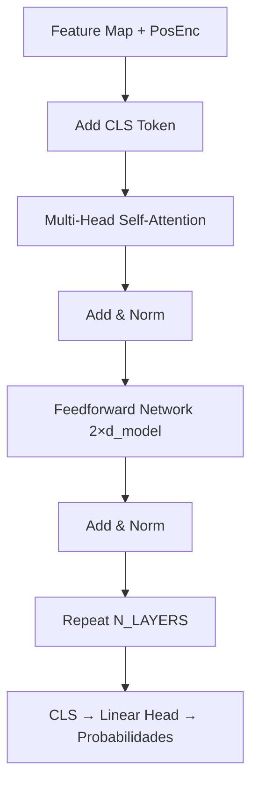

# Proyecto EEG MI — Primer Avance

Este repositorio contiene el trabajo inicial de análisis y preprocesamiento de señales EEG de **imaginación motora (MI)**, así como la implementación del primer modelo base **FBCSP + LDA**.  

A continuación se describen las fases clave desarrolladas hasta el momento.

---

## 1. EDA de datos RAW

Antes de cualquier limpieza se realizó un **análisis exploratorio de los datos crudos** (`data/raw`) con los siguientes objetivos:

- **Inventario de archivos:** verificación de sujetos disponibles y runs por sujeto.
- **Conteo de eventos por clase:** Left, Right, Both Fists, Both Feet, Rest.
- **Amplitud extrema:** cálculo de percentil 99 (`p99_uV`) y desviación estándar por canal (`std_uV`) para detectar outliers.
- **Artefactos musculares (EMG):** estimados mediante la **relación de potencia 20–40 Hz** en los canales motores.
- **PSD (densidad espectral de potencia):** inspección en C3, Cz, C4.
- **Separabilidad inicial:** análisis con **t-SNE** sobre log-varianza de las épocas.

**Hallazgos importantes en RAW:**
- Gran variabilidad inter-sujetos en amplitud (50–300 μV).
- Presencia de ruido y artefactos musculares en varios sujetos.
- La mayoría de sujetos muestran **silhouette score negativo** → baja separabilidad entre clases en el estado crudo.
- Dataset heterogéneo, requiere un pipeline de preprocesamiento robusto.

---

## 2. Pipeline de Preprocesamiento

El preprocesamiento busca limpiar los EEG y asegurar que las features extraídas representen la actividad neuronal y no artefactos.


### Explicación paso a paso

1. **Normalización de nombres y montaje**  
   - Estandarización de canales y asignación al sistema 10–20.  
   - Permite localizar fácilmente C3, Cz y C4, fundamentales en MI.

2. **Filtro Notch**  
   - Remueve interferencia eléctrica de 50/60 Hz.  
   - Evita que el ruido de la red contamine las bandas mu y beta.

3. **Clipping de amplitud**  
   - **Softclip:** atenúa valores extremos sin descartarlos.  
   - **Hardclip:** elimina épocas con amplitudes fuera de rango.  
   - Previene que outliers extremos dominen el entrenamiento.

4. **Filtro Bandpass (8–30 Hz)**  
   - Aísla las bandas mu (8–12 Hz) y beta (13–30 Hz).  
   - Son las más asociadas a imaginación motora.

5. **ICA (FastICA / Picard)**  
   - Separa fuentes independientes y elimina componentes de artefactos:  
     - Oculares (EOG),  
     - Musculares (EMG),  
     - Cardiacos (ECG).  
   - Esencial para mejorar la pureza de las señales.

6. **Segmentación en epochs**  
   - Ventana de **0.5–4.5 s post-estímulo**.  
   - Captura la actividad cortical durante la tarea, evitando ruido al inicio/final.

7. **Rechazo automático de épocas**  
   - Se eliminan ensayos con amplitudes excesivas (peak-to-peak).  
   - Garantiza un set final más balanceado y limpio.

8. **Exportación en formato FIF**  
   - Archivos por sujeto (`Sxxx_MI-epo.fif`).  
   - Estandariza y permite reutilizar fácilmente con MNE y modelos posteriores.

**Resultados del preprocesamiento:**
- Reducción significativa de amplitudes extremas.  
- Menor presencia de artefactos EMG.  
- Balance de clases más uniforme por sujeto.  
- Mejora en separabilidad en varios sujetos (Δ silhouette > 0).  

---

## 3. EDA de datos POST

Una vez aplicado el pipeline, se evaluaron nuevamente los datos procesados (`data/processed`) con métricas y visualizaciones:

- **Conteo de épocas por sujeto y clase** → para verificar balance.
- **PSD en C3, Cz, C4 por clase** → confirmación de la actividad en bandas mu/beta.
- **Topomapas de potencia** en bandas mu y beta → patrones espaciales de activación.
- **QA automático:** detección de sujetos problemáticos (muy pocas épocas, EMG residual alto, silhouette muy negativo).
- **Comparación RAW vs POST**:  
  - Δ silhouette → mejora en separabilidad de clases.  
  - Δ amplitud extrema (`p99_uV`) → reducción de outliers.  
  - EMG ratio → caída en la mayoría de sujetos.

**Hallazgos importantes en POST:**
- Disminución clara en amplitudes extremas y ruido.  
- Aumento en la calidad de épocas disponibles.  
- Mejor diferenciación de clases en varios sujetos.  
- Sin embargo, algunos sujetos siguen presentando problemas de EMG o baja separabilidad, que deberán manejarse con **flags de QA** en futuras iteraciones.

---

## Conclusión preliminar

El **pipeline de preprocesamiento** aplicado transforma un dataset crudo, heterogéneo y ruidoso, en un conjunto más limpio y balanceado. Esto sienta las bases para los experimentos con modelos como **FBCSP + LDA** y, en fases posteriores, comparaciones con **SVM, Riemannianos y redes profundas**.

--- 

## 4. FBCSP + LDA

**Objetivo:** clasificar EEG de *Motor Imagery* (μ/β) usando **Filter-Bank CSP (FBCSP)** + **LDA con shrinkage**.  
Se evalúa en dos configuraciones: **INTRA-subject** (K-Fold por ensayos) y **INTER-subject** (folds predefinidos por sujetos desde JSON, con **validación interna por sujetos** y opción de **calibración**).

### Pipeline
1. **Carga y recorte** de épocas MNE (`.fif`) con ventana fija `crop_window` (p. ej., 0.5–3.5 s).
2. **Selección de canales motores** (opcional): `C3, CZ, C4, FC3, FC4, CP3, CPZ, CP4`; alineación de canales en VAL/TEST con `reorder_channels`.
3. **Banco de filtros** (μ/β): subbandas densas de 2 Hz entre 8–30 Hz (11 bandas).
4. **CSP por subbanda**: `n_csp` componentes, `reg='ledoit_wolf'`, `log=True` (devuelve vectores de varianzas proyectadas).  
   - **Fit** con **solo TRAIN** del fold; **transform** en VAL/TEST.
5. **Concatenación de features** de todas las subbandas.
6. **Estandarización** (z-score de features) con `StandardScaler` (fit en TRAIN).
7. **Clasificador**: `LDA(solver='lsqr', shrinkage='auto')`.

### FBCSP + LDA (features)
Para cada sub-banda (8–30 Hz, pasos de 2 Hz):
1) Filtramos; 
2) Ajustamos **CSP** en TRAIN y transformamos VAL/TEST;  
3) Calculamos **log-varianzas** de las `n_csp` componentes;  
4) **Concatenamos** features de todas las sub-bandas.  
Luego estandarizamos y clasificamos con **LDA (shrinkage)**.

### Evaluaciones
- **INTRA-subject** (`run_intra_all`):
  - `StratifiedKFold(k)` por sujeto (split por ensayos).
  - Métricas: Accuracy y F1-macro por fold; promedio ± DE por sujeto; fila **GLOBAL**.
  - Artefactos: CSV, TXT, figuras de matrices de confusión (mosaicos).

- **INTER-subject** (`run_inter_subject_cv_from_json`):
  - Folds desde JSON (`train/test` por sujetos).
  - **Validación interna por sujetos**: fracción `val_ratio_subjects` dentro de TRAIN para ajuste/selección.
  - Calibración per-subject (k-shots): Para cada sujeto de test, tomamos **k=5** épocas por clase como **calibración** y evaluamos en el resto de sus épocas. Durante la calibración se re-ajustan **FBCSP** (fit con TRAIN + k-shots del propio sujeto) y **LDA** (tras estandarización). Este esquema refleja el uso real de BCI: una **breve sesión inicial** de calibración por usuario mejora sustancialmente la transferencia inter-sujeto.
  - Métricas: VAL (acc, F1-macro) y TEST (acc, F1-macro) por fold + **GLOBAL**.
  - Artefactos: CSV consolidado, TXT de métricas, TXT con `classification_report` por fold, figuras de confusión por fold y **GLOBAL**.

### Antileakage y reproducibilidad
- CSP, scaler y LDA se ajustan **exclusivamente** con TRAIN del fold (o TRAIN+CALIB si la calibración está activa).  
- VAL/TEST sólo se **transforman**.  
- Canales de VAL/TEST se **reordenan** para coincidir con TRAIN.  
- Se generan logs con timestamp y parámetros para auditoría.

### Principales hiperparámetros
- `crop_window=(0.5, 3.5)` s  
- `motor_only=True | False`  
- `zscore_epoch=True | False` (z-score por época previo a CSP)  
- `fb_bands`: denso (2 Hz) de 8–30 Hz  
- `n_csp`: típicamente 4–8 (p. ej., 4 ó 6)  
- `val_ratio_subjects≈0.16`, `calibrate_n` (sólo INTER)

### Salidas
- **Tablas** (`/models/fbcsp_lda/tables`): CSV de métricas con fila GLOBAL.
- **Logs** (`/models/fbcsp_lda/logs`): TXT de métricas y `classification_reports_by_fold_*.txt`.
- **Figuras** (`/models/fbcsp_lda/figures`): matrices de confusión por sujeto/fold y GLOBAL.

> **Nota:** El mapeo de clases usa `LabelEncoder` para asegurar etiquetas consistentes. No influye en la señal ni en parámetros del modelo.

## 5. Modelo Riemanniano para MI-EEG (MDM / FgMDM)

**Resumen.** Cada época se representa por su **matriz de covarianza SPD** (SPD significa Symmetric Positive Definite) por sub-banda (8–30 Hz), y se clasifica por **distancia geodésica** a las medias de clase en la geometría Riemanniana (pyRiemann). Usamos **OAS** como estimador de covarianza y **normalización por traza** para estabilizar escala. Dos variantes:
- **MDM**: Minimum Distance to Mean sobre un **bloque-diagonal** que apila las covariancias de todas las bandas.
- **FgMDM**: Filter-geodesic MDM, que **agrega en el manifold** la información multi-banda.

**Preprocesado.**
- Ventana temporal: `crop_window=(0.5, 3.5)` (configurable).
- Canales: `motor_only=True` (C3, Cz, C4, FC3/4, CP3/z/4).
- Banco de bandas: denso 8–30 Hz, paso 2 Hz.
- Covarianza: `Covariances(estimator='oas')` + normalización por traza.

**Validaciones.**
- **INTRA-sujeto (k-fold)**: 5 folds estratificados dentro de cada sujeto; métricas por sujeto + GLOBAL.
- **INTER-sujeto (folds JSON)**: split de **validación por sujetos** dentro de TRAIN; ajuste del espacio **solo con TRAIN**; métricas en VALID y TEST; **matriz de confusión global** y `classification_report` por fold.

**Calibración per-subject (k-shots, recomendada).**
Para cada sujeto de TEST, tomamos **k=5** épocas por clase como **calibración**, recomputamos el espacio con `TRAIN + CALIB_del_sujeto` y **evaluamos en el resto** de sus épocas. Refleja el uso real de BCI con una **breve sesión inicial** de calibración por usuario. (Alternativamente, se puede calibrar con **n sujetos completos** del TEST si el escenario lo requiere.)

**Features (Riemann).** Cada época se representa por **matrices de covarianza SPD** por sub-banda (estimador OAS + normalización por traza).  
**Geometría.** Las SPD viven en un manifold; usamos **distancia geodésica Riemanniana** (afin-invariante) para comparar.  
**Clasificadores.**  
- **MDM**: calcula la **media Riemanniana** por clase y predice por **distancia al centroide**. Multi-banda vía **bloque diagonal**.  
- **FgMDM**: mantiene **una SPD por banda** y **agrega geodésicamente** la info multi-banda; suele rendir mejor.  
**En este repo:** `model='fgmdm'` (por defecto en inter-sujeto) ⇒ el clasificador activo es **FgMDM**.


---

# 🧠 EEGNet (4 clases, 8 canales) con Augmentaciones, TTA y Fine-Tuning Progresivo

Este proyecto implementa un clasificador EEGNet en PyTorch para señales EEG de imaginación motora (MI-EEG), con:
- Entrenamiento global (5 folds) sobre datos sin balancear por sujeto/clase.
- **Augmentaciones (jitter, ruido, channel-drop)** inspiradas en CNN+Transformer.
- **SGDR (CosineAnnealingWarmRestarts)** para ajustar la tasa de aprendizaje.
- **Label smoothing**, **pesos por clase** y **max-norm** como regularizaciones.
- **Test-Time Augmentation (TTA)** por desplazamientos temporales.
- **Fine-Tuning progresivo** por sujeto con penalización L2SP.

---

## 📦 Estructura general

| Bloque | Descripción |
|:--|:--|
| **Carga de datos** | Lectura de archivos EDF, extracción de epochs `[-1,5]s`, selección de 8 canales, z-score por época. |
| **Normalización** | Estandarización por canal usando estadísticas del conjunto de entrenamiento. |
| **Modelo** | EEGNet con filtros temporales y espaciales separables, salida lineal para 4 clases. |
| **Entrenamiento global** | Augments + SGDR + label smoothing + pesos por clase + max-norm. |
| **Evaluación (Test)** | TTA por *time-shifts* y métricas (ACC, F1, matriz de confusión). |
| **Fine-tuning progresivo** | Adaptación por sujeto con L2SP y congelamiento progresivo de capas. |

---

## ⚙️ Configuración global (hiperparámetros)

| Categoría | Parámetro | Valor | Explicación |
|:--|:--|:--|:--|
| Datos | FS | 160 Hz | Frecuencia de muestreo objetivo |
| | TMIN/TMAX | -1.0 / 5.0 s | Ventana temporal de cada ensayo |
| | EXPECTED_8 | C3,C4,Cz,CP3,CP4,FC3,FC4,FCz | Canales usados |
| | NORM_EPOCH_ZSCORE | True | Z-score por época y canal |
| Split | VAL_SUBJECT_FRAC | 0.18 | % de sujetos usados como validación |
| | VAL_STRAT_SUBJECT | True | Validación estratificada por etiqueta dominante |
| Train | EPOCHS_GLOBAL | 100 | Épocas máximas |
| | BATCH_SIZE | 64 | Tamaño de batch |
| | LR_INIT | 1e-2 | Tasa inicial de aprendizaje |
| | SGDR_T0 / SGDR_Tmult | 6 / 2 | Ciclos coseno: 6, 12, 24… |
| | GLOBAL_PATIENCE | 10 | Early stopping |
| EEGNet | F1 / D | 24 / 2 | Filtros temporales y multiplicador depthwise |
| | kernel_t / k_sep | 64 / 16 | Kernels temporal y separable |
| | pool1_t / pool2_t | 4 / 6 | Reducción temporal por bloque |
| | drop1_p / drop2_p | 0.35 / 0.6 | Dropout |
| | chdrop_p | 0.10 | Channel dropout |
| Loss | label_smoothing | 0.05 | Suavizado de etiquetas |
| | boost (clase 2/3) | 1.25 / 1.05 | Pesos extra para clases raras |
| Augments | p_jitter / p_noise / p_chdrop | 0.35 / 0.35 / 0.15 | Probabilidad de aplicar cada tipo |
| | max_jitter_frac / noise_std | 0.03 / 0.03 | Magnitud del jitter y ruido |
| TTA | shifts_s | ±0.075,…,0 s | Desplazamientos en inferencia |
| FT | CALIB_CV_FOLDS | 4 | Folds internos por sujeto |
| | FT_EPOCHS | 30 | Épocas por modo |
| | FT_HEAD_LR / FT_BASE_LR | 1e-3 / 5e-5 | LR para cabeza y base |
| | FT_L2SP | 1e-4 | Penalización de alejamiento de pesos globales |
| | FT_PATIENCE / FT_VAL_RATIO | 5 / 0.2 | Early stopping y validación interna |

---

## 🧠 Arquitectura EEGNet

### Estructura general
Entrada: `(B, 1, T, C)` → Salida: `(B, 4)`  
(`B`: batch, `T`: tiempo ≈ 960, `C`: canales=8)

1. **ChannelDropout (p=0.10)**  
   Apaga canales completos aleatoriamente (simula fallos de electrodos).

2. **Bloque temporal**
   ```python
   Conv2d(1 → F1, kernel=(64,1)) → BN → ELU
   ```
   Extrae patrones de oscilación y filtros pasa-banda temporales.

3. **Bloque espacial (depthwise)**
   ```python
   Conv2d(F1 → F1*D, kernel=(1, n_ch), groups=F1)
   AvgPool2d(4,1) → Dropout(0.35)
   ```
   Aprende combinaciones espaciales (proyecciones de canales) por cada filtro temporal.

4. **Bloque separable temporal**

   ```python
   Conv2d(F2 → F2, kernel=(16,1), groups=F2)
   Conv2d(F2 → F2, kernel=(1,1))
   AvgPool2d(6,1) → Dropout(0.6)
   ```
   Refina dinámicas temporales específicas con pocos parámetros.

5. **Head**

   ```python
   Flatten → Linear(1920→128) → ELU → Linear(128→4)
   ```
   Proyección final a clases.

## 🧩 Entrenamiento global

- **Optimizador:** Adam (`LR inicial = 1e-2`)
- **Scheduler:** CosineAnnealingWarmRestarts (SGDR)  
  - Ciclos: 6, 12, 24, 48 épocas…  
  - Cada reinicio restablece el LR alto para explorar nuevos mínimos.
- **Augmentaciones:** jitter temporal, ruido gaussiano, channel-drop
- **Pérdida:** Weighted Soft CrossEntropy con *label smoothing* (0.05)
- **Regularizaciones:**
  - Max-norm = 2.0 (filtros espaciales y FC)
  - Dropout + ChannelDropout
  - Label smoothing + pesos por clase

## 🔄 CosineAnnealingWarmRestarts (SGDR)

Controla la **tasa de aprendizaje (LR)** de forma cíclica, alternando fases de exploración y refinamiento.

### 🧠 Intuición
- **Grandes saltos** → explora nuevos mínimos.  
- **LR pequeño** → refina soluciones locales.  
- **Reinicios** → permite escapar de mínimos subóptimos.

### ⚙️ Parámetros
- **T₀ = 6** → duración del primer ciclo (épocas).  
- **T_mult = 2** → cada ciclo siguiente dura el doble: 6, 12, 24, 48, …

El LR se reinicia al valor inicial en cada ciclo, generando una curva coseno decreciente dentro de cada fase.

### 💡 Consejos prácticos
| Situación | Ajuste recomendado |
|:--|:--|
| `val_acc` oscila mucho | Aumenta **T₀** o reduce **LR_INIT** |
| Entrenamiento estancado | Sube **LR_INIT** o acorta **T₀** |

✨ **Idea clave:** equilibrar exploración (LR alto) y refinamiento (LR bajo) para alcanzar mejores mínimos sin sobreentrenar.

## 🌈 Augmentaciones (entrenamiento)

Tres transformaciones principales se aplican por batch (B, 1, T, C):

### 1️⃣ Jitter temporal
Desplaza la señal unos milisegundos (roll en el eje temporal).  
**max_jitter_frac = 0.03**  → ±180 ms para 6 s (T≈960)  

**Motivo:** simula pequeñas desincronizaciones del inicio del ensayo (onset).  
**Rango típico:** 0.02–0.05 (±120–300 ms).  

---

### 2️⃣ Ruido gaussiano
**noise_std = 0.03**  

**Motivo:** mejora la robustez frente a ruido fisiológico y electrónico.  
**Rango recomendado:** σ = 0.01–0.05 para señales EEG normalizadas (z-scoreadas).  

---

### 3️⃣ Channel-drop
**p_chdrop = 0.15**, **max_chdrop = 1**  

**Motivo:** incrementa la robustez espacial ante la pérdida o mal contacto de electrodos.  
**Recomendación:** apagar 1–2 canales cuando se trabaja con 8 canales totales.  

## 🧱 Regularizaciones

### 🧩 Label Smoothing (ε=0.05)
Suaviza las etiquetas para evitar sobreconfianza:

**Fórmula:**
\[
\tilde{y} = (1 - \varepsilon) \cdot \text{one\_hot} + \frac{\varepsilon}{K}
\]

Esto reduce la probabilidad de que el modelo se vuelva demasiado confiado en una sola clase, mejorando la **calibración** de las predicciones.

---

### ⚖️ Pesos por clase
Para corregir el desbalance de clases en el entrenamiento se asignan pesos distintos a las clases minoritarias:

- **Clase 2 (Both Fists):** ×1.25  
- **Clase 3 (Both Feet):** ×1.05  

Esto aumenta la contribución de las clases menos frecuentes en la función de pérdida y ayuda a equilibrar el rendimiento entre categorías.

---

### 🧮 Max-Norm
Se aplica un límite **L2 máximo (2.0)** sobre los pesos de los filtros.  
Este método evita la explosión de pesos y mejora la **estabilidad del entrenamiento**.  
Si el modelo sobreajusta, se puede reducir el límite a 1.8; si no aprende bien, puede aumentarse a 2.5–3.0.

---

## 🔮 Inferencia: Test-Time Augmentation (TTA)

Durante la fase de inferencia, cada señal EEG se **desplaza ligeramente en el tiempo** y se promedian las predicciones (logits) para mejorar la robustez.

**Desplazamientos usados (en segundos):**  
[-0.075, -0.05, -0.025, 0, +0.025, +0.05, +0.075]

**Propósito:**  
Aumentar la resistencia a pequeñas desalineaciones temporales entre ensayos.

**Costo:**  
Proporcional al número de desplazamientos (más TTA = más tiempo de inferencia).

**Recomendaciones:**
- Máximo rendimiento: usar 5–7 desplazamientos.  
- Cuando el tiempo sea crítico: usar 3 desplazamientos ([-0.05, 0, +0.05]).

---

## 🔧 Fine-Tuning progresivo por sujeto

Cada sujeto de test se adapta mediante **fine-tuning** interno (4 folds por sujeto), ajustando partes específicas del modelo sin olvidar el conocimiento global.

**Modos de ajuste:**
- **out:** solo la capa de salida  
- **head:** capa totalmente conectada + salida  
- **spatial+head:** bloque espacial + cabeza del modelo  

**Parámetros clave:**
- LR base: 5e-5  
- LR cabeza: 1e-3  
- L2SP: 1e-4  
- Patience (early stopping): 5  
- Validación interna: 20%  

El objetivo es **personalizar el modelo a cada sujeto** preservando las representaciones generales aprendidas.

---

## 📊 Métricas y salidas

- **Accuracy global** y **F1 macro** promedio.  
- Curvas de entrenamiento: `training_curve_foldX.png`  
- Matrices de confusión: `confusion_global_foldX.png`  
- Resultados del fine-tuning: `acc_global`, `acc_ft` y diferencia `Δ(FT-Global)`.

---

## 💡 Cheatsheet de ajuste

| Problema | Causa posible | Solución sugerida |
|:--|:--|:--|
| **Overfitting (Train↑, Val↓)** | Modelo muy complejo o augmentaciones suaves | Subir dropout, aumentar ε de Label Smoothing, reducir F1 |
| **Underfitting (Train↓, Val↓)** | LR demasiado bajo o augmentaciones muy fuertes | Aumentar LR, reducir ruido/jitter |
| **Oscilaciones en validación** | LR alto o ciclos SGDR muy cortos | Aumentar T₀ o reducir LR inicial |
| **Mala precisión en clases 2/3** | Pocas muestras o sin boost | Subir pesos (1.4 / 1.2) |
| **Modelo inestable** | Max-norm demasiado alto | Bajar a 1.8–2.0 |

---


## 🧮 Flujo resumido del pipeline
```bash
raw EDF ─► selección de 8 canales
        └► epoch [-1, 5] s @160 Hz
            └► z-score por época
                └► split Kfold5 (train/val/test)
                    └► estandarización canal-fit(train)
                        └► EEGNet + Augments
                            └► Train con SGDR
                                └► Test con TTA
                                    └► Fine-tuning por sujeto (L2SP)
```

---

# 🧠 Arquitectura CNN + Transformer para EEG Motor Imagery

Este documento describe detalladamente la arquitectura híbrida **CNN + Transformer** usada para clasificar señales EEG (motor imagery), los **hiperparámetros**, la **estrategia de entrenamiento**, y técnicas como **EMA**, **warmup scheduler** y **fine-tuning por sujeto**.

---

## ⚙️ 1. Flujo general del pipeline

```text
EEG EDF Files
   │
   ├── Preprocesamiento (notch, filtro, zscore)
   │
   ├── División por sujetos (train / val / test)
   │
   ├── CNN temporal → Extracción de patrones locales
   │
   ├── Proyección → tokens (d_model)
   │
   ├── Transformer Encoder → atención temporal
   │
   ├── Token CLS → Head lineal
   │
   ├── Entrenamiento con Focal Loss + Warmup + EMA
   │
   └── Fine-tuning por sujeto (4-fold CV)
```

---

## 🧱 2. Arquitectura de la CNN

La parte convolucional del modelo extrae **patrones espacio-temporales** del EEG.  

### Flujo de capas
```mermaid
graph TD
    A[EEG 8xT] --> B[Conv1D 8→32, k=129, s=2]
    B --> C[DepthwiseSepConv 32→64]
    C --> D[DepthwiseSepConv 64→128]
    D --> E[Conv1D 128→d_model (1x1)]
    E --> F[Feature Map (d_model x T′)]
```

### Detalles
| Capa | Descripción |
|:--|:--|
| **Conv1D 8→32** | Captura patrones largos (~1 s). Reduce T a la mitad (stride=2). |
| **Depthwise Separable Conv** | Divide la convolución en “por canal” y “mezcla de canales” para reducir parámetros. |
| **GroupNorm + ELU** | Normaliza por grupos y usa activación ELU para estabilidad. |
| **Dropout (p_drop)** | Evita sobreajuste. |
| **Conv1D 1×1 → d_model** | Proyecta las features al espacio de embedding del Transformer. |

El número de filtros crece (32→64→128) para permitir que capas más profundas aprendan representaciones más abstractas y ricas.  
Mientras tanto, la longitud temporal `T` se reduce con strides (`T′ ≈ T / 8`).

---

## 🔺 3. Arquitectura del Transformer Encoder

El Transformer modela dependencias **de largo alcance** en el tiempo entre los tokens de EEG.

### Flujo de procesamiento


### Módulos internos
| Componente | Descripción |
|:--|:--|
| **Positional Encoding** | Suma señales sinusoidales para indicar posición temporal. |
| **Token [CLS]** | Representación global que resume toda la secuencia. |
| **Multi-Head Attention (MHA)** | Cada cabeza aprende relaciones distintas entre tiempos. |
| **Feedforward Network (FFN)** | Dos capas lineales (2×d_model) con GELU y Dropout. |
| **LayerNorm + Residuals** | Aumenta estabilidad y flujo del gradiente. |
| **N_LAYERS** | Controla cuántas veces se repite el bloque completo. |

---

## ⚙️ 4. Hiperparámetros explicados

### 🧩 Entrenamiento
| Parámetro | Descripción |
|:--|:--|
| `EPOCHS` | Épocas máximas de entrenamiento. |
| `BATCH_SIZE` | Cuántas muestras se procesan por iteración. |
| `BASE_LR` | Tasa de aprendizaje inicial. |
| `WARMUP_EPOCHS` | Épocas donde el LR aumenta gradualmente (warmup). |
| `PATIENCE` | Número de épocas sin mejora antes de detener. |

### ⚡ Preprocesamiento EEG
| Parámetro | Función |
|:--|:--|
| `DO_NOTCH` | Aplica filtro notch (60 Hz). |
| `DO_BANDPASS`, `BP_LO`, `BP_HI` | Filtro pasa banda entre 4–38 Hz (motor imagery). |
| `DO_CAR` | Referencia común. |
| `ZSCORE_PER_EPOCH` | Normaliza cada época individualmente. |
| `RESAMPLE_HZ` | Nueva frecuencia de muestreo (si se usa). |

### 🧠 Modelo CNN + Transformer
| Parámetro | Significado |
|:--|:--|
| `D_MODEL` | Dimensión interna de embeddings. |
| `N_HEADS` | Número de cabezas en MHA. |
| `N_LAYERS` | Capas Transformer Encoder. |
| `P_DROP` | Dropout en capas CNN. |
| `P_DROP_ENCODER` | Dropout dentro del Transformer. |

### 🔁 Entrenamiento avanzado
| Parámetro | Función |
|:--|:--|
| `USE_EMA` | Usa Exponential Moving Average de pesos. |
| `EMA_DECAY` | Factor de suavizado (0.9995). |
| `USE_WEIGHTED_SAMPLER` | Balancea sujetos y clases. |

### 🧬 Fine-Tuning (por sujeto)
| Parámetro | Explicación |
|:--|:--|
| `FT_N_FOLDS` | Cross-validation interna por sujeto. |
| `FT_FREEZE_EPOCHS` | Épocas congelando backbone. |
| `FT_UNFREEZE_EPOCHS` | Épocas entrenando todo. |
| `FT_LR_HEAD` | LR para la capa de salida. |
| `FT_LR_BACKBONE` | LR para el backbone (menor). |
| `FT_PATIENCE` | Early stopping en FT. |
| `FT_WD` | Weight decay. |
| `FT_AUG` | Probabilidades de augmentación. |

---

## 🧮 5. Conceptos clave

| Concepto | Significado |
|:--|:--|
| **Batch size** | Número de ejemplos procesados por actualización. |
| **d_model** | Tamaño del vector de embedding (dimensión del token). |
| **T′** | Longitud temporal reducida tras convoluciones (por stride). |
| **Warmup scheduler** | Aumenta el LR suavemente al inicio y lo reduce con coseno al final. |
| **EMA** | Mantiene una versión suavizada de los pesos para evaluación estable. |
| **Fine-tuning** | Adapta el modelo global a cada sujeto con aprendizaje incremental. |

---

## 🔥 6. Estrategias de entrenamiento

### 🧩 Warmup + Cosine Scheduler
Durante las primeras `WARMUP_EPOCHS`, el LR aumenta gradualmente desde un valor pequeño hasta el `BASE_LR`.  
Después, decrece siguiendo una curva coseno hasta llegar a un mínimo (10 % del valor base).

**Ventajas:**
- Evita inestabilidad al inicio.  
- Permite convergencia más suave.  
- Refina los últimos pasos con actualizaciones pequeñas.

**Visualización:**
```
LR
│        /\
│       /  \
│      /    \______
│_____/            Época
    ↑ warmup     ↑ decay
```

---

### ⚙️ Exponential Moving Average (EMA)
EMA mantiene una copia “promediada” de los pesos que evoluciona lentamente:

```
θ_ema ← decay * θ_ema + (1 - decay) * θ_model
```

**Ventajas:**
- Reduce el ruido en los pesos.  
- Mejora la estabilidad y generalización.  
- Se usa el modelo EMA para evaluación.

---

### 🧠 Fine-Tuning progresivo
Después del entrenamiento global (multi-sujeto), cada sujeto pasa por un ajuste personalizado:

1. **Congelar backbone:** se entrena solo la cabeza (aprende rápido sin olvidar).  
2. **Descongelar todo:** se entrena el modelo completo con LR bajo.  
3. **4-Fold CV:** cada sujeto se valida en 4 divisiones internas.

**Beneficios:**
- El modelo se adapta a las variaciones individuales del EEG.  
- Evita sobreajuste manteniendo conocimiento general.

---

## 📊 7. Resumen estructural

| Bloque | Función | Output |
|:--|:--|:--|
| CNN | Extrae patrones locales del EEG. | (B, C′, T′) |
| Proyección 1×1 | Convierte a espacio de embedding. | (B, d_model, T′) |
| Transformer Encoder | Modela dependencias temporales largas. | (B, L, D) |
| Token [CLS] + Head | Predicción binaria (izq./der.). | (B, 2) |

---

## 🧾 8. Resumen final de conceptos

- La **CNN** actúa como extractor jerárquico local.  
- El **Transformer** modela relaciones temporales globales.  
- El **warmup scheduler** suaviza el aprendizaje.  
- El **EMA** estabiliza los pesos.  
- El **fine-tuning** personaliza por sujeto.  

Con este pipeline, el modelo logra una **alta robustez y generalización inter-sujeto**, adaptándose luego individualmente.

---


---

## ⚙️ Entrenamiento

- **Optimización:** AdamW (lr=1e-3), scheduler Warmup + Cosine decay.
- **Pérdida:** Focal Loss (γ=1.5, α balanceado).
- **Regularización:** Dropout, EMA (decay=0.9995), Early stopping.
- **Aumentaciones:** jitter temporal, ruido aditivo, channel dropout.
- **Weighted Sampler:** balanceo por clase y sujeto.
- **Cross-validation:** 5 folds por sujeto (train/val/test).

---

## 🧮 Robustez con Pocas Muestras

El modelo logra buen desempeño a pesar del número reducido de épocas (~45 por sujeto) gracias a:

1. **Extracción jerárquica (CNN):** aprende patrones reutilizables entre sujetos.
2. **Eficiencia paramétrica:** depthwise separable convs reducen la cantidad de pesos entrenables.
3. **Regularización y data augmentation.**
4. **Atención global:** el Transformer aprende relaciones invariantes al sujeto.
5. **Fine-tuning individual:** refina el modelo global con datos de cada sujeto.

---

## 🔍 Interpretabilidad

- **Attention Maps:** muestran qué regiones temporales fueron más relevantes.
- **Grad-CAM++ 1D:** identifica segmentos EEG que influyeron en la decisión.
- **Visualizaciones por sujeto:** se generan automáticamente en test (solo aciertos).

---

## 📊 Métricas

- Accuracy global por fold.
- F1 Macro (balance entre clases).
- Matrices de confusión.
- Especificidad y sensibilidad promedio.


---


# 🧠 Comparación de Modelos CNN+Transformer — EEG PhysioNet

---

## ⚙️ Modelos evaluados

| Modelo | Configuración | Capas Transformer | Parámetros | FLOPs | Enfoque |
|:--|:--|--:|--:|--:|:--|
| `nb2_h4_optimized_ligero` | d=128, L=1 | 1 | 195 k | 19.6 M | Modelo eficiente (low-power) |
| `nb2_h4_optimized_medio` | d=128, L=3 | 3 | 460 k | 58.8 M | Modelo balanceado (mejor F1) |
| `nb2_h4` | d=144, L=2 | 2 | 400 k | 48.6 M | Modelo base (referencia) |

---

## 📊 Resultados globales

| Modelo | ACC (mean) | F1_macro (mean) | FT_ACC (mean) | FLOPs | Latencia | Parámetros |
|:--|--:|--:|--:|--:|--:|--:|
| **nb2_h4_optimized_medio** | **0.8305 ± 0.0188** | **0.8298 ± 0.0188** | 0.8623 ± 0.0154 | 58.8 M | 2.81 ms | 460k |
| **nb2_h4_optimized_ligero** | 0.8211 ± 0.0167 | 0.8211 ± 0.0167 | **0.8731 ± 0.0133** | **19.6 M** | **1.31 ms** | **195k** |
| **nb2_h4 (base)** | 0.8203 ± 0.0112 | 0.8203 ± 0.0112 | 0.8596 ± 0.014 | 48.6 M | 1.76 ms | 400k |

---

## 🧩 Análisis de rendimiento

### 🥇 `nb2_h4_optimized_medio`
- Máximo F1 (≈0.83).  
- 3 capas Transformer → mejor estabilidad inter-fold.  
- Costo computacional medio-alto (≈58M FLOPs).

### 🥈 `nb2_h4_optimized_ligero`
- F1 ≈ 0.82, con solo 1 capa Transformer.  
- 3× más rápido que el medio.  
- Ideal para tiempo real o dispositivos embebidos.

### 🥉 `nb2_h4` (base)
- F1 ≈ 0.82, sin mejora clara frente al ligero.  
- FLOPs intermedios (48M), sin ganancia significativa.

---

## ⚖️ Trade-off general

| Modelo | F1_macro | FLOPs | Latencia | F1 / Costo (relativo) | Recomendación |
|:--|--:|--:|--:|--:|:--|
| 🥇 `nb2_h4_optimized_medio` | **0.8298** | 58.8 M | 2.8 ms | 1.0× | Mejor F1 absoluto |
| 🥈 `nb2_h4_optimized_ligero` | 0.8211 | **19.6 M** | **1.3 ms** | **2.5× más eficiente** | Mejor costo-beneficio |
| 🥉 `nb2_h4` (base) | 0.8203 | 48.6 M | 1.76 ms | 1.5× | Equilibrado, sin ganancia clara |

---

## 💡 Conclusiones

- **Ganancia F1:** El modelo medio supera al ligero solo +1 %, pero triplica su costo computacional.  
- **Robustez:** Los tres modelos muestran varianza baja → pipeline estable y reproducible.  
- **Fine-Tuning:** mejora promedio de 4–5 % adicional en accuracy por sujeto.  
- **Uso recomendado:**  
  - **Entrenamiento offline / máxima precisión:** `nb2_h4_optimized_medio`.  
  - **Despliegue en tiempo real / eficiencia:** `nb2_h4_optimized_ligero`.

---


